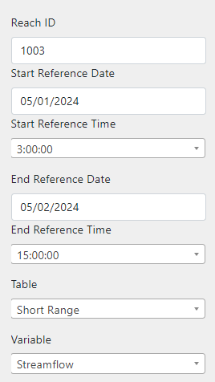

Add BigQuery Functionality in Controller
========================================
In this section of the tutorial, you'll be adding a request to your javascript code to send the form input to your controller and 
updating the controller to receive and begin processing that input

0. Start from Previous Solution (Optional)
---------------------------------
If you wish to use the previous solution as a starting point:

.. code-block:: bash
    
    git clone https://github.com/Aquaveo/tethys-bigquery.git
    cd tethysapp-nwm_bigquery_tutorial
    git checkout Step-6-Complete

1. Add POST Endpoint to Controller
-----------------------------------
Our first step will be adding a POST endpoint to the controller. In order to send back a response with this endpoint, we'll need to import a new module.
In `controllers.py`, add this import:

.. code-block:: python

    from django.http import JsonResponse

Next, we'll overwrite the POST method in our controller class

In your NWMBigQueryMap class, add this method:

.. code-block:: python

    def post(self, request, *args, **kwargs):
        form_data = request.POST

        return JsonResponse({'success': True,
                             'input': form_data})

This code will be run whenever we send a POST request to the home url and will send a simple response back with the same data sent in the request.

2. Add a Fetch Request to javascript Form Submission
----------------------------------------------------
Now we need to make an actual request to our new endpoint. We'll do this within our form submission portion in `app.js`:

.. code-block:: javascript

    $("#query-form").on("submit", function(event) {
        event.preventDefault();
        var formData = new FormData(this);
       
        // Check if all required fields are filled in
        const requiredFields = ['reach_id', 'start_date', 'start_time', 'end_date', 'end_time', 'table', 'variable'];
        const missingFields = requiredFields.filter(field => !formData.get(field));
        if (missingFields.length > 0) {
            TETHYS_APP_BASE.alert("danger", "Make sure to fill in all required fields.");
            return;
        }

        // Add this portion:
        fetch('/apps/nwm-bigquery-tutorial/', {
            method: 'POST',
            body: formData
         }).then(response => response.json())
         .then(data => {
            console.log(data);
        });
    });

Again, we test our results here by displaying the results returned to the request to the console. 

Now that we’ve added our request, let’s test it. Fill out the query form with whatever inputs you’d like, and press the query button. 
Open the console and you should see the results displayed with all of your inputs. 

3. Run the Query
----------------
 
Now that we’ve got our form submission and receiving working, we need to run our queries. 

To prepare to run queries, we need to add a few more imports. Add these to your imported modules in `controllers.py`:

.. code-block:: python

    import os # Add this
    import datetime # Add this

    from tethys_sdk.routing import controller
    from tethys_sdk.layouts import MapLayout
    from tethys_sdk.gizmos import DatePicker, SelectInput, TextInput, Button

    from django.http import JsonResponse

    from google.cloud.bigquery import Client # Add this

    from .app import NwmBigqueryTutorial as app

You should've created a BigQuery account and have a service account key, but if not follow these steps here: :download:`BigQuery Account/Private Key Setup Instructions<files/BigQuery Account Creation and API Private Key Setup Instructions.pdf>`

We'll need to use the `os` library to setup our environment. Add the following code between your imports and your `NWMBigQueryMap` class 
in `controllers.py`. Replace the name of the service account key with the name of your service account key json filename

.. code-block:: python

    os.environ['GOOGLE_APPLICATION_CREDENTIALS'] = os.getcwd() + 'name_of_your_file_here.json'

Next, we'll add a method to run our query using the BigQuery API. Add this method to your `NWMBigQueryMap` class:

.. code-block:: python

    def run_query(self, query_parameters):
        project_id = app.get_custom_setting('project_id')
        client = Client( project=project_id)
       
        reach_id = query_parameters.get('reach_id')
        table = query_parameters.get("table")
        variable_choice = query_parameters.get("variable")

        start_date = query_parameters.get('start_date')
        start_date = datetime.datetime.strptime(start_date, '%m/%d/%Y').date()
        start_date = str(start_date.strftime("%Y-%m-%d"))

        start_time = query_parameters.get('start_time')

        end_date = query_parameters.get('end_date')
        end_date = datetime.datetime.strptime(end_date, '%m/%d/%Y').date()
        end_date = str(end_date.strftime("%Y-%m-%d"))

        end_time = query_parameters.get('end_time')

        forecast_offset = query_parameters.get('forecast_offset')

        query = f"""
                    SELECT
                        reference_time,
                        ensemble,
                        {variable_choice} as variable_value
                    FROM
                        `bigquery-public-data.national_water_model.{table}_channel_rt`
                    WHERE
                        feature_id = {reach_id}
                        AND
                        reference_time >= '{start_date} {start_time}'
                        AND
                        reference_time <= '{end_date} {end_time}'
                        AND
                        forecast_offset = {forecast_offset}
                    ORDER BY
                        reference_time, ensemble
                """
        job = client.query(query)
        df = job.to_dataframe()
       
        return df

Let’s go over how this code works.

On these lines, we retrieve the value of our custom Project ID setting and pass it into a new instance of the google BigQuery Client class.

.. code-block:: python

    project_id = app.get_custom_setting('project_id')
    client = Client( project=project_id)

Next, we retrieve and format our query parameters on these lines:

.. code-block:: python

    reach_id = query_parameters.get('reach_id')
    table = query_parameters.get("table")
    variable_choice = query_parameters.get("variable")

    start_date = query_parameters.get('start_date')
    start_date = datetime.datetime.strptime(start_date, '%m/%d/%Y').date()
    start_date = str(start_date.strftime("%Y-%m-%d"))

    start_time = query_parameters.get('start_time')

    end_date = query_parameters.get('end_date')
    end_date = datetime.datetime.strptime(end_date, '%m/%d/%Y').date()
    end_date = str(end_date.strftime("%Y-%m-%d"))

    end_time = query_parameters.get('end_time')

    forecast_offset = query_parameters.get('forecast_offset')

Next, we form a string to serve as our query and perform the query, returning the results in the form of a dataframe:

.. code-block:: python

    query = f"""
                SELECT
                    reference_time,
                    ensemble,
                    {variable_choice} as variable_value
                FROM
                    `bigquery-public-data.national_water_model.{table}_channel_rt`
                WHERE
                    feature_id = {reach_id}
                    AND
                    reference_time >= '{start_date} {start_time}'
                    AND
                    reference_time <= '{end_date} {end_time}'
                    AND
                    forecast_offset = {forecast_offset}
                ORDER BY
                    reference_time, ensemble
            """
    
    job = client.query(query)
    df = job.to_dataframe()

	 return df

4. Test Query Functionality
---------------------------
Before we can test this query functionality, we’ll have to make a small change to our POST endpoint in `controllers.py`:

.. code-block:: python

    def post(self, request, *args, **kwargs):
        form_data = request.POST

        query_results = self.run_query(form_data)

        return JsonResponse({'success': True,
                             'results': query_results.to_dict()})

Here, we just call the run_query method, storing the results in the variable `query_results`. We then return that in our JSON response, converting query_results to a dictionary 
for now to amke it possible to send in the form of JSON data.

Now, we can actually test our query results. Go back to your application, refresh, and feel free to use these query parameters for your test run:

Now open your console and you'll find the query results. In the next steps of the tutorial, we'll be processing and displaying those results in a much more useful way, in the form of a graph!

5. Solution
-----------
This concludes the Add BigQuery Functionality in Controller portion of the NWM BigQuery Tutorial. You can view the solution on GitHub at https://github.com/Aquaveo/tethys-bigquery/tree/Step-7-Complete or clone it as follows:

.. code-block:: bash

    git clone https://github.com/Aquaveo/tethys-bigquery.git
    cd tethysapp-nwm_bigquery_tutorial
    git checkout Step-7-Complete 

