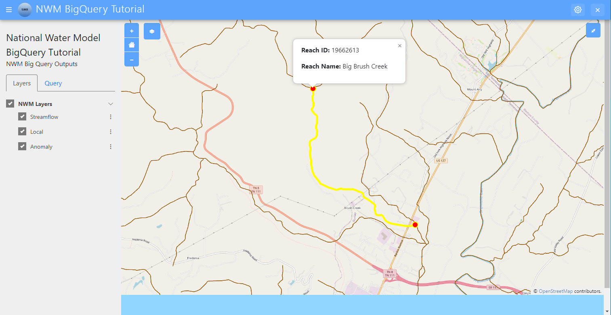

Add Click and Hover Detection on Stream Features
================================================

In this section, you'll be learning a few more feature of Tethys. You'll be adding click detection to the stream 
features on the map, which will result in highlighting the selected stream. You'll then be adding hover detection on 
those highlighted streams so that the stream's information will pop up above the stream.

0. Start from Previous Solution (Optional)
-------------------------------------------
If you wish to use the previous solution as a starting point:

.. code-block:: bash

    git clone https://github.com/Aquaveo/tethys-bigquery.git
    cd tethysapp-nwm_bigquery_tutorial
    git checkout Step-10-Complete

1. Setup for Click Detection
----------------------------
First, we'll need to add a few imports. To begin, add the following code to `home.html`:

.. code-block:: html

    
        
        {{ block.super }}
        
    

2. Add Click Detection
-----------------------
Next, you'll add click detection to the stream features on the map. This will allow you to highlight the selected stream and add the 
selected stream's reach id to the reach ID input field in the query parameters form.

To prepare to add click detection, we'll need to access the map itself, so we'll add a map variable in our main function in our `app.js` file

.. code-block:: javascript

    $(function() {
        $("#table").on("change", function() {
            var table = $("#table").val();
            $("#forecast_offset").val(forecastOffsets[table]);
        });

        var map = TETHYS_MAP_VIEW.getMap();

Next, we'll add a click event listener to the map also in the main $(function() { }) function.

.. code-block:: javascript 
    
    $(function() {
        $("#table").on("change", function() {
            var table = $("#table").val();
            $("#forecast_offset").val(forecastOffsets[table]);
        });

        var map = TETHYS_MAP_VIEW.getMap();
        
        map.on('click', function(evt) {
            console.log("Map clicked");
        });

For now, this listener just displays "map clicked" so we can test that your click detection is working. Go ahead and test it out!

3. Get Clicked on Stream Feature
---------------------------------
Next, we'll add code to get the clicked on stream feature. First, we'll need some helper functions. We won't go into too much detail on how each of these work, so go ahead and add this code to your `app.js` file:

.. code-block:: javascript

    var lastHighlightedLayer;

    //get distance by zoom
    function getDistanceByZoom(zoom) {
        switch (true) {
            case (zoom > 20):
                return 25;
            case (zoom > 17):
                return 125;
            case (zoom > 14):
                return 250;
            case (zoom > 11):
                return 500;
            case (zoom > 8):
                return 1000;
            case (zoom > 5):
                return 2000;
        }
    
        return 10000;
    }

    const isBlank = (str) => {
        return (!str || /^\s*$/.test(str) || str === null);
    }
    
    const getCurrentReachOnClick = (esriPaths) => {
        // Transform ESRI paths into coordinates array for LineString
        const coordinates = esriPaths.map(path => path.map(point =>[point[0], point[1]]))[0];
        const geojsonObject = 
            {
                'type': 'LineString',
                'coordinates': coordinates
            }
    
        return geojsonObject
    }

    function processStreamServiceQueryResult(zoom, point, response, map) {
        var minStreamOrder = 5;
        var soAttrName = null;
        var fidAttrName = null;
        var nameAttrName = null;
    
        if (response.features.length === 0) {
            return;
        }
    
        if (zoom >= 5) minStreamOrder--;
        if (zoom >= 6) minStreamOrder--;
        if (zoom >= 8) minStreamOrder--;
        if (zoom >= 10) minStreamOrder--;
    
    
        response.fields.forEach(function (field) {
            if (!fidAttrName && /^(reach_id|station_id|feature id)$/i.test(field.alias)) {
                fidAttrName = field.name;
            }
    
            if (!soAttrName && /^(stream order)$/i.test(field.alias)) {
                soAttrName = field.name;
            }
    
            if (!nameAttrName && /^((reach|gnis)?_?name)$/i.test(field.alias)) {
                nameAttrName = field.name;
            }
        });
    
        var validFeatures = [];
    
        response.features.forEach(function (feature) {
            if (feature.attributes[soAttrName] < minStreamOrder) {
                return;
            }
    
            validFeatures.push(feature);
        });
    
        validFeatures.map(function getDistanceFromPoint(feature) {
            feature.distance = geometryEngine.distance(point, feature.geometry);
            return feature;
        })
        validFeatures.sort(function sortByDistance(a, b) {
            return a.distance - b.distance;
        });
    
        if (validFeatures.length === 0) {
            return;
        }
        
        let stationName = isBlank(validFeatures[0].attributes[nameAttrName]) ? 'N/A' : validFeatures[0].attributes[nameAttrName]
        let stationID = validFeatures[0].attributes[fidAttrName]
        var featureAttributes = validFeatures[0].attributes;
    
        let currentGeojsonReach;
        currentGeojsonReach = getCurrentReachOnClick(validFeatures[0].geometry.paths)
        
        
    
        if (currentGeojsonReach != undefined) {
    
            var coordinates = currentGeojsonReach.coordinates;
            var firstPoint = coordinates[0];
            var lastPoint = coordinates[coordinates.length - 1];
    
            var geojsonSource = new ol.source.Vector({
                features: (new ol.format.GeoJSON()).readFeatures(currentGeojsonReach, {
                    dataProjection: 'EPSG:4326',
                    featureProjection: 'EPSG:3857'
                })
            });
    
            var firstPointFeature = new ol.Feature({
                geometry: new ol.geom.Point(ol.proj.transform(firstPoint, 'EPSG:4326', 'EPSG:3857'))
            });
    
            var lastPointFeature = new ol.Feature({
                geometry: new ol.geom.Point(ol.proj.transform(lastPoint, 'EPSG:4326', 'EPSG:3857'))
            });
            
    
            geojsonSource.addFeature(firstPointFeature);
            geojsonSource.addFeature(lastPointFeature); 
    
            var highlightedLayer = new ol.layer.Vector({
                source: geojsonSource,
                style: function(feature) {
                    if (feature.getGeometry() instanceof ol.geom.Point) {
                        return new ol.style.Style({
                            image: new ol.style.Circle({
                                radius: 7,
                                stroke: new ol.style.Stroke({
                                color: 'yellow',
                                width: 2
                                }),
                                fill: new ol.style.Fill({
                                    color: 'red'
                                })
                            })
                        });
                    } else {
                        return new ol.style.Style({
                            stroke: new ol.style.Stroke({
                                color: 'yellow',
                                width: 5
                            })
                        });
                    }
                }
            });
    
            if (lastHighlightedLayer) {
                map.removeLayer(lastHighlightedLayer);
            }
        
            lastHighlightedLayer = highlightedLayer
    
            highlightedLayer.setZIndex(1000);
            map.addLayer(highlightedLayer);
        }
        map.getView().fit(geojsonSource.getExtent());
        map.getView().setZoom(map.getView().getZoom() - 1);
        
    
        return stationID;
    }

Next, we'll need to add code to our map click event listener:

.. code-block:: javascript

    map.on('click', function(evt) {
        const pixel = map.getEventPixel(evt.originalEvent);
        let features = [];

        let mapServerInfo = [];

        let clickCoordinate = evt.coordinate;

        const layer = map.getLayers().getArray().filter(layer => layer.hasOwnProperty('tethys_data')).find(layer => layer.tethys_data.layer_id == 'anomaly');
        const urlService = layer.getSource().getUrls()[0]; // collect mapServer URL
        const id = layer
            .getSource()
            .getParams()
            .LAYERS.replace('show:', '') // remove the visible component to just get the raw url
        const server = mapServerInfo.find(server => server.url === urlService) // see if server already exists in mapServerInfo
        if (!server) {
            const spatialReference= {"latestWkid":3857,"wkid":102100}
            const geometry = {"spatialReference":spatialReference ,"x":clickCoordinate[0],"y":clickCoordinate[1]}
            
            const queryLayer5 = {
                geometry: JSON.stringify(geometry),
                // layer: {"id":"5"},
                outFields:'*',
                geometryType: 'esriGeometryPoint',
                spatialRel: "esriSpatialRelIntersects",
                units:'esriSRUnit_Meter',
                distance: getDistanceByZoom(map.getView().getZoom()),
                sr: `${map.getView().getProjection().getCode().split(/:(?=\d+$)/).pop()}`,
                // layers: `all:${server.layers}`, // query all the layer ids for htis map server built above
                returnGeometry: true, // I don't want geometry, but you might want to display it on a 'selection layer'
                f: 'json',
                inSR:102100,
                outSR:4326
            }
            const url = new URL(`${urlService}/5/query`);
            url.search = new URLSearchParams(queryLayer5);
            axios.get(url).then((response) => {
                const filteredArray = response.data['features'][0]
                const actual_zoom = map.getView().getZoom()
                var esriMapPoint = new Point({
                    longitude: clickCoordinate[0],
                    latitude: clickCoordinate[1],
                    spatialReference: spatialReference,
                });
                let currentStreamFeatureID = processStreamServiceQueryResult(actual_zoom, esriMapPoint, response.data, map)
                if (currentStreamFeatureID != undefined) {
                $("#reach_id").val(currentStreamFeatureID);
                }
            }).catch((error) => {
                console.log(error);
            });
        } else {
            mapServerInfo.find(server => server.url === url).layers.push(id) // if so, add the ID of this layer for query
        }

        map.forEachFeatureAtPixel(pixel, function(feature, layer) {
            features.push(feature);
        });
        
    });

Let's go over what this function is doing: 

First, it finds the location of the click on the map.

It then makes a request for information on the specific reach the user has 
clicked on, and uses that information to create a new layer that you see as the yellow 
highlight with red dots at the end just like in the screenshot above.

Now that we've got the code prepared, let's test it out! Refresh the application and click on any stream on the map. The map should zoom in on the selected stream and highlight over the specific reach you clicked inside of with yellow. The reach's ID should also be in the reach ID query input field. 

4. Setup Overlay
----------------
Our last step in this portion of the tutorial involves hover detection. We'll be adding hover detection for these
highlighted reaches so that when the user hovers over a selected reach, the reach id and name will pop up in a 
built in little info box above the reach.

First, we need to setup this info box. Add the following code to your `NWMBigQueryMap` class in `controllers.py`:

.. code-block:: python

    @controller(name="home", app_workspace=True)
    class NWMBigQueryMap(MapLayout):
        app = app
        base_template = 'nwm_bigquery_tutorial/base.html'
        template_name = 'nwm_bigquery_tutorial/home.html'
        map_title = 'National Water Model BigQuery Tutorial'
        map_subtitle = 'NWM Big Query Outputs'
        plot_slide_sheet = True
        show_properties_popup = True  # Add this line
        basemaps = [
            'OpenStreetMap',
            'ESRI',
            'Stamen',
            {'Stamen': {'layer': 'toner', 'control_label': 'Black and White'}},
        ]

Next, add this code to `home.html`

.. code-block:: html

    
        {{ block.super }}
        

        <a href="#" id="popup-closer" class="ol-popup-closer">Close</a>
        

        

    

This html will be used to popup wherever we need to display the reach information.

Next, we'll add some code to identify to the popup info box and assign an OpenLayers overlay to it. Add the following code to your `app.js` file towards the top:

.. code-block:: javascript

    var lastHighlightedLayer;

    var content;
    var closer;

    var overlay;

Then, add this code within our main function:

.. code-block:: javascript

    $(function() {
        var map = TETHYS_MAP_VIEW.getMap();

        content = $("#properties-popup-content");
        closer = $("#properties-popup-close-btn");

        overlay = new ol.Overlay({
            element: document.getElementById('properties-popup'),
            autoPan: true,
            autoPanAnimation: {
            duration: 250
            }
        })

        closer.on("click", function() {
            overlay.setPosition(undefined);
            closer.blur();
            return false;
        })
    map.addOverlay(overlay);

5. Add Hover Detection
-----------------------
Next, we'll add our hover detection code: Add this code close to the end of the processStreamServiceQueryResult function:

.. code-block:: javascript

        map.on('pointermove', function(e) {
            map.forEachFeatureAtPixel(e.pixel, function(feature, layer) {
                if (layer === lastHighlightedLayer) {
                    content.html(`
<strong>Reach ID:</strong> ${stationID}

<strong>Reach Name:</strong> ${stationName}
`);
                    var reach_line_feature = layer.getSource().getFeatures()[0]; // Get the line feature itself for coordinates
                    var coordinates = reach_line_feature.getGeometry().getCoordinates()[0]; // Get the first coordinate of the line
                    overlay.setPosition(coordinates);
                }
                else {
                    
                    overlay.setPosition(undefined);
                    closer.blur();
                    
                }
            })
        })
    }

   map.getView().fit(geojsonSource.getExtent());
   map.getView().setZoom(map.getView().getZoom() - 1);
   
  
   return stationID;

Lastly, we'll want to make sure that the overlay dissapears when we need it to. 
Add these lines of code:

.. code-block:: javascript

    $(function() {
    $("#table").on("change", function() {
        var table = $("#table").val();
        $("#forecast_offset").val(forecastOffsets[table]);
    });

    var map = TETHYS_MAP_VIEW.getMap();
    
    content = $("#properties-popup-content");
    closer = $("#properties-popup-close-btn");

    overlay = new ol.Overlay({
        element: document.getElementById('properties-popup'),
        autoPan: true,
        autoPanAnimation: {
        duration: 250
        }
    })

    // Add these lines
    closer.on("click", function() {
        overlay.setPosition(undefined);
        closer.blur();
        return false;
    });

.. code-block:: javascript

    if (!server) {
        overlay.setPosition(undefined);
        closer.blur();

Ok, let's test it! Refresh the application and select a reach. The reach's ID and name should pop up in the info box above the reach 
after you hover over the highlighted reach just like in the screenshot above.

6. Solution
-----------
This concludes the Add click and Hover Detection on Stream Features section of the NWM BigQuery Tutorial. You can view the solution on GitHub at https://github.com/Aquaveo/tethys-bigquery/tree/Step-11-Complete or clone it as follows:

.. code-block:: bash

    git clone https://github.com/Aquaveo/tethys-bigquery.git
    cd tethysapp-nwm_bigquery_tutorial
    git checkout Step-11-Complete 

