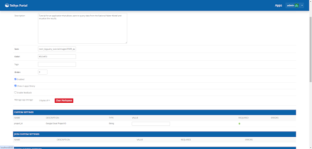
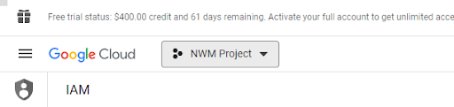

Add Custom Google Project ID Setting to Application
===================================================
This section of the tutorial explains how to add custom settings to a Tethys application.

0. Start From Solution
-----------------------
GIT INFORMATION HERE

1. Import Custom settings
-------------------------
First, we'll need to import the `CustomSetting` class. Add this import to your app.py file:

.. code-block:: python

    from tethys_sdk.app_settings import CustomSetting

2. Add Project ID Custom Setting
--------------------------------
Next, we’ll need to add our custom setting to the application. This custom setting will let you add a 
project ID to use when running queries with BigQuery. We’ll be adding this custom setting to our 
NwmBigQueryApp class:

.. code-block:: python

    class NwmBigqueryTutorial(TethysAppBase):
    """
    Tethys app class for NWM BigQuery Tutorial.
    """

    name = 'NWM BigQuery Tutorial'
    description = 'Tutorial for an application that allows users to query data from the National Water Model and visualize the results.'
    package = 'nwm_bigquery_tutorial'  # WARNING: Do not change this value
    index = 'home'
    icon = f'{package}/images/NWM_app_icon.png'
    root_url = 'nwm-bigquery-tutorial'
    color = '#5CA4FD'
    tags = ''
    enable_feedback = False
    feedback_emails = []

    def custom_settings(self):
        custom_settings = (
            CustomSetting(
                name='project_id',
                type=CustomSetting.TYPE_STRING,
                description='Google Cloud Project ID',
                required=True
            ),
        )
        return custom_settings

Now if you refresh your app, open your settings in the top right corner, you’ll find the new custom 'Project ID' setting among your other 
application settings.

3. Add Project ID
-----------------
You'll want to add your BigQuery Project ID for our next step of running queries. You can find this ID in the BigQuery console here:

Click on the gray box and copy the project ID shown there and add it to your settings. 

We'll get into how to access this custom setting's value in the next portion of the tutorial.

4. Solution
-----------
This concludes the section on adding custom settings to a Tethys application.
GIT INFO HERE

