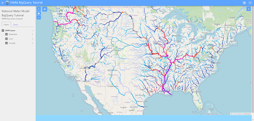
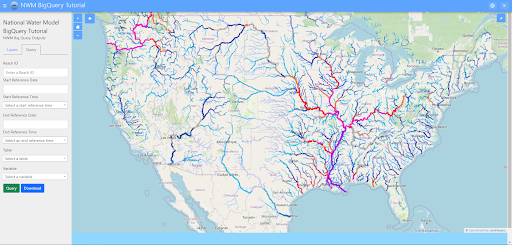

Add Query Fields
=================
In this section of the tutorial, we’ll go over two important tools/concepts in Tethys: Gizmos and extending templates. 
Gizmos are pre-built, reusable components for use in web applications. They simplify web development by allowing you to 
add features and user interface elements without needing to build them from scratch. In this portion of the tutorial,
we’ll be adding some user input fields and buttons that will be used to send queries. Once we’ve prepared those Gizmos,
we’ll go over placing them in our page by extending a template.

0. Start From Previous Solution (Optional)
------------------------------------------
If you wish to use previous solution as a starting point:
GIT INSTRUCTIONS HERE

1. Import Necessary Gizmos
--------------------------
First, we need to import the Gizmos that we’ll be using in our application. 
Add the following import statements to the top of the `controllers.py` file:

.. code-block:: python

    from tethys_sdk.routing import controller
    from tethys_sdk.layouts import MapLayout
    from tethys_sdk.gizmos import DatePicker, SelectInput, TextInput, Button

    from .app import NwmBigqueryTutorial as app

2. Add Gizmos to Controller
---------------------------
Next, we'll add the Gizmos to the controller. Add the following code to the `NWMBigQueryMap` class in the `controllers.py` file. This may seem a bit overwhelming at first, but we'll break it down after the code snippet.

.. code-block:: python

    def get_context(self, request, *args, **kwargs):
        # Reach ID text input field Gizmo
        reach_id = TextInput(display_text='Reach ID', name='reach_id', placeholder='Enter a Reach ID', attributes={"class": "form-input"})

        # Create time range options for start and end reference times
        time_range = [(f"{i}:00:00", f"{i}:00:00") for i in range(0, 24)]
        start_time_options = [('Select a start reference time', '')] + time_range
        end_time_options = [('Select an end reference time', '')] + time_range

        # Start and end reference date and time Gizmos
        start_date = DatePicker(display_text='Start Reference Date', name='start_date', attributes={"class": "form-input"})
        start_time = SelectInput(display_text='Start Reference Time', name='start_time', multiple=False, options=start_time_options, attributes={"class": "form-input"})
        end_date = DatePicker(display_text='End Reference Date', name='end_date', attributes={"class": "form-input"})
        end_time = SelectInput(display_text='End Reference Time', name='end_time', multiple=False, options=end_time_options, attributes={"class": "form-input"})

        # Table and variable select input drop down Gizmos
        table_options = [('Select a table', ''),
                         ('Short Range', 'short_range'),
                         ('Medium Range', 'medium_range'),  
                         ('Medium Range No DA', 'medium_range_no_da'),  
                         ('Long Range', 'long_range')]
       
        table = SelectInput(display_text='Table', name='table', multiple=False, options=table_options, attributes={"class": "form-input"})
        variable_options = [('Select a variable', ''), ('Streamflow', 'streamflow'), ('Velocity', 'velocity')]
        variable = SelectInput(display_text='Variable', name='variable', multiple=False, options=variable_options, attributes={"class": "form-input"})\
       
        # Forecast offset text input field Gizmo - this will be hidden but is used in the query and will be
        # changed in javascript dynamically based on the table that's been selected
        forecast_offset = TextInput(name='forecast_offset', attributes={"style": "display:none;"})

        # Download and Query buttons
        download_button = Button(display_text='Download', name='download', style='primary', attributes={"id": "download-button"})
        query_button = Button(display_text='Query', name='query', style='success', submit=True, attributes={'form': 'query-form'})

        # Generate the base context to add Gizmos to
        context = super().get_context(request, *args, **kwargs)

        # Add Gizmos to the context
        context['reach_id'] = reach_id
        context['start_date'] = start_date
        context['start_time'] = start_time
        context['end_date'] = end_date
        context['end_time'] = end_time
        context['table'] = table
        context['variable'] = variable
        context['download_button'] = download_button
        context['query_button'] = query_button
        context['forecast_offset'] = forecast_offset

        return context

Let's take the table portion and examine the code to look at how we work with Gizmos:

.. code-block:: python

    table_options = [('Select a table', ''), ('Streamflow', 'streamflow'), ('Local', 'local'), ('Anomaly', 'anomaly')]
    table = SelectInput(display_text='Table', name='table', multiple=False, options=table_options, attributes={"class": "form-input"})

On the first line we create a list of tuples that will be our drop down options in the table SelectInput. The first item in each 
tuple will be the text that is displayed to the user in the drop down menu, while the second item is the value we get when we 
access the user’s selection. 

On the second line, we create a new SelectInput Gizmo. On this line, we give this SelectInput some customization:

* **display_text:** this text is what will show up alongside the actual Gizmo as a sort of label.
* **name:** a simple identifier for this Gizmo.
* **multiple:** option to either allow or not allow for multiple selections to be made at one time in the drop down selector
* **options:** the list of options to populate the drop down selector in this Gizmo
* **attributes:** this attribute allows you to make direct changes to the attributes of the HTML tag that is created when this Gizmo is displayed in a page/template.

3. Extent MapLayout Template and Add Gizmos
As part of the map layout feature, there is a built in html document, or what we call a **template** in Tethys. This template is a base template, 
meaning that it’s built to be added onto, or extended. To extend a template means to add onto specific, pre-built portions of the template. We refer 
to those portions of the template as **blocks**. Let’s look at how to extend our map layout template.

First, let’s add our home template to our controller: This will allow us to make changes to home.html to actually make adjustments to our page itself.

.. code-block:: python

    @controller(name="home", app_workspace=True)
    class NWMBigQueryMap(MapLayout):
        app = app
        base_template = 'nwm_bigquery_tutorial/base.html'
        template_name = 'nwm_bigquery_tutorial/home.html' # Add this
        map_title = 'National Water Model BigQuery Tutorial'
        map_subtitle = 'NWM Big Query Outputs'

Now, let's prepare our home.html file. We're going to remove most of the contents of the file until we're left with this:

.. code-block:: html

    
    

    
    

Next, remove the current **'extends'** tag at the very top of the file and replace it with this:

.. code-block:: html

    

This tag simply means that in home.html, we'll be building on the map_layout template built into Tethys

You'll also need to add a line to the app_content block:

.. code-block:: html

    
    {{ block.super }} # Add this line
    

Block.super simply makes sure that we aren’t fully overriding the elements already in the app_content block, we’re just adding onto it. 
You can think of it as calling super() in an inherited class in Python.

Our next step will be to add a tab to the menu on the left (just like the ‘Layers’ tab that’s already there). 

To do this, we’ll be adding on to the custom_map_tabs block. Add this section to your home.html file:

.. code-block:: html

    
    {{ block.super }}
    <li class="nav-item active" role="presentation">
    <button class = "nav-link"
            id="query-tab-toggle"
            data-bs-toggle="tab"
            role="tab"
            data-bs-target="#query-tab-panel"
            aria-controls="query-tab-panel"
            aria-selected="true">Query</button>
    </li>
    

This code adds a new tab to the left side of the page. The button tag is what actually creates the tab, and the data-bs-target attribute is what links the button to 
the panel that will be displayed when the tab is clicked. We'll be adding that panel next.

Let's reload our page and take a look, you should see a new tab header with "Query" on the left side of your web page just like this:

Now we need to add the query tab contents, so add this to your home.html file:

.. code-block:: html

    
    {{ block.super }}
    

        

             
            <form id="query-form" method="POST">
                
                
                
                
                
                
                
                
                
            </form>
            

                
                
            

        

    

    

This builds on the custom map tab panels portion, adding a form with our Gizmos inside it. Let’s walk through how this works:

* In our get_context method from our NWMBigQueryMap class, we create our Gizmo objects that are then sent to the template through a context. A context is the set of variables or information that a controller sends to a template, in python we work with it in the form of a dictionary.
* We access the context on each of the lines of code that uses `` 

Let's check our application once more! Reload the page, and click on the query tab header, and you should see something that looks like this: 

4. Solution
-----------
This concludes the Add Query Fields portion of the NWM BigQuery Tutorial. 
GIT INFORMATION HERE

