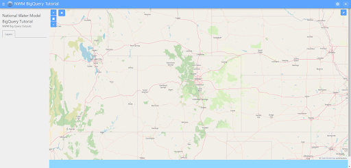

Configure MapLayout
===================
In this section of the tutorial, you will configure your Tethys app with the MapLayout. 
This feature of Tethys was designed to further streamline the creation of web applications 
that use common web mapping tools, such as aw eb map and its commonly expected functionality, 
such as feature display and interaction via clicking and plotting. To learn more about the 
MapLayout,  see `Map Layout <https://docs.tethysplatform.org/en/stable/tethys_sdk/layouts/map_layout.html#map-layout>`_.

0. Start From Previous Solution (Optional)
-------------------------------------------
If you wish to use the previous solution as a starting point:

.. code-block:: bash
    
    git clone https://github.com/Aquaveo/tethys-bigquery.git
    cd tethysapp-nwm_bigquery_tutorial
    git checkout Step-1-Complete

1. Swap Default Home Controller with MapLayout
----------------------------------------------
When you scaffold a new app, by default the controllers.py script contains a home function that controls the 
backend logic for the home screen of your app. It is of course possible to add a Map View and other map tools 
using Tethys Gizmos, but since we know we want a single-page web mapping application with common web mapping 
features, we can instead configure the Tethys Map Layout. 

This can be done by replacing the entire controller.py with the following code:

.. code-block:: python

    from tethys_sdk.layouts import MapLayout
    from tethys_sdk.routing import controller
    from .app import NwmBigqueryTutorial as app

    @controller(name="home", app_workspace=True)
    class NWMBigQueryMap(MapLayout):
        app = app
        base_template = 'nwm_bigquery_tutorial/base.html'
        map_title = 'National Water Model BigQuery Tutorial'
        map_subtitle = 'NWM Big Query Outputs'
        
And that's it! Check your app in the browser (http://localhost:8000/apps/nwm-bigquery-tutorial/). Refresh if needed, and confirm the change. It shoud look like the screenshot at the top of this section.

With just under a dozen lines of code, you now have a fully interactive map with extent controls, basemap layer change, full screen mode, and a layers panel.

We'll learn how to further customize the MapLayout and add National Water Model featrues to the map in the next section.

2. Solution
------------
This conclues the Configure MapLayout portion of the NWM BigQuery Tutorial. You can view the solution on GitHub at https://github.com/Aquaveo/tethys-bigquery/tree/Step-2-Complete or clone it as follows:

.. code-block:: bash

    git clone https://github.com/Aquaveo/tethys-bigquery.git
    cd tethysapp-nwm_bigquery_tutorial
    git checkout Step-2-Complete 