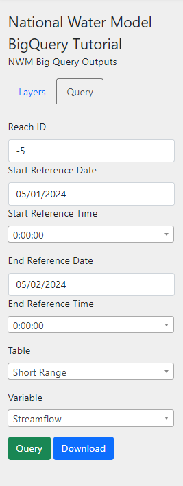

Error Handling and Add Graph Loading Animation
==============================================
In this section of the tutorial, we'll add some error handling in our query functionality 
and add a loading animation when the graph's data is being loaded.

0. Start from Previous Solution (Optional)
------------------------------------------
If you wish to use the previous solution as a starting point:

.. code-block:: bash

    git clone https://github.com/Aquaveo/tethys-bigquery.git
    cd tethysapp-nwm_bigquery_tutorial
    git checkout Step-9-Complete

1. Error Handling
------------------
First, we'll add some generic error handling to check for any issues in the query process. Open `app.js` and add the following 
code to your fetch request:

.. code-block:: javascript

    fetch('/apps/nwm-bigquery-tutorial/', {
            method: 'POST',
            body: formData
         }).then(response => response.json())
         .then(data => {
            var variable = formData.get('variable');
            var reach = formData.get('reach_id');
            MAP_LAYOUT.update_plot(`${variable} at ${reach}`, data.data, data.graph_layout);
        })
        // Add these lines here
        .catch(error => {
            console.log(error);
            TETHYS_APP_BASE.alert("danger", "There was an issue loading that query's results. Please try again.");
         });
         
This code will catch any errors that occur during the fetch request and display an alert to the user if an error occurs.

2. No Data returned
--------------------
Next, we'll add a check to see if the data returned from the query is empty. If the data is empty, we'll display an alert to the user.

.. code-block:: javascript

    fetch('/apps/nwm-bigquery-tutorial/', {
            method: 'POST',
            body: formData
         }).then(response => response.json())
         .then(data => {
            var variable = formData.get('variable');
            var reach = formData.get('reach_id');
            // Add these lines here
            if (data.data[0].x.length == 0) {
                TETHYS_APP_BASE.alert("danger", "No data was returned from your query. Please try again.");
                return;
            }
            MAP_LAYOUT.update_plot(`${variable} at ${reach}`, data.data, data.graph_layout);
        })
        .catch(error => {
            console.log(error);
            TETHYS_APP_BASE.alert("danger", "There was an issue loading that query's results. Please try again.");
         });

Here we simply check the first group in the data to see if the x array is empty. If it is, we display an alert to the user.
This error is easier to test, try using these query parameters and run the query. You should see an alert pop up with the message we added. 

    
3. Add Loading Animation
-------------------------
Next, we'll add a loading animation to the graph when the data is being loaded. This will provide a visual cue that the data is being loaded.

First, download this animation gif :download:`here <images/graph_loading_gif.gif>` or select any image or GIF you'd like and save it to 
the `tethysapp/nwm_bigquery_tutorial/public/images` directory.

Next, add this code to your `app.js` file within your form submit event listener:

.. code-block:: javascript

    MAP_LAYOUT.show_plot();
    MAP_LAYOUT.update_plot(``, {}, {});
    
    // Add these lines
    var loadingGifDiv = $('
', {
        id: 'loading-gif-div',
        css: { display: 'none',
                position: 'fixed',
                top: '60%',
                left: '30%',
                width: '20%',
                'z-index': 1000
              } 
    });

    var loadingGif = $('', {
        id: 'loading-gif-image',
        src: '/static/nwm_bigquery_tutorial/images/graph-loading-image.gif',
        alt: 'Loading...',
        css: { width: '100%' }
    });

    loadingGifDiv.append(loadingGif);

    var slideSheet = $(".slide-sheet-content").first();
    slideSheet.find(".row").eq(1).append(loadingGifDiv);

These lines use jQuery to create a div element that contains an image element with the loading animation, and adds it to the correct row in our slide 
sheet so that it will show up just over our graph once a query has been submitted.

Refresh your application and run a query. You should see the loading animation appear over the graph. You'll notice it doesn't go away 
when the data is loaded, but we'll fix that in the next step.

4. Hide Loading Animation
--------------------------
Finally, we'll hide the loading animation in three places in our code. We'll hide it when data is returned in the fetch request, 
when no data is returned, and when an error occurs. 

Add these lines to your fetch request:

.. code-block:: javascript

    fetch('/apps/nwm-bigquery-tutorial/', {
        method: 'POST',
        body: formData
    }).then(response => response.json())
    .then(data => {
        var variable = formData.get('variable');
        var reach = formData.get('reach_id');
        if (data.data[0].x.length == 0) {
            TETHYS_APP_BASE.alert("danger", "No data was returned from your query. Please try again.");
            // Add this line
            $("#loading-gif-div").hide();
            return;
        }
        MAP_LAYOUT.update_plot(`${variable} at ${reach}`, data.data, data.graph_layout);
        // Add this line
        $("#loading-gif-div").hide();

    }).catch(error => {
        console.log(error);
        TETHYS_APP_BASE.alert("danger", "There was an issue loading that query's results. Please try again.");
        // Add this line
        $("#loading-gif-div").hide();
    });

Refresh your application and run a query. You should see the loading animation appear over the graph and disappear when the data is loaded. 

5. Solution
-----------
This concludes the Error Handling and Add Graph Loading Animation portion of the NWM BigQuery Tutorial. You can view the solution on GitHub at https://github.com/Aquaveo/tethys-bigquery/tree/Step-10-Complete or clone it as follows:

.. code-block:: bash

    git clone https://github.com/Aquaveo/tethys-bigquery.git
    cd tethysapp-nwm_bigquery_tutorial
    git checkout Step-10-Complete 