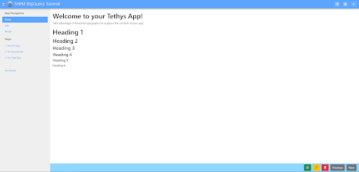

New Tethys App Project
======================
In this section of the tutorial, you will create a new Tethys App project using the scaffold. 
The following topics will be reviewed in this tutorial: 

* Scaffolding New Tethys Apps
* Managing App Dependencies
* Adding a Custom Icon
* Customizing App Theme Color

1. Generate Scaffold
--------------------

To generate a new Tethys app using the scaffold, open a terminal and execute the following commands:

.. code-block:: bash

    # Activate the tethys environment
    conda activate tethys

.. code-block:: bash

    # Create a working directory (if it doesn't exist already)
    mkdir ~/tethysdev
    cd ~/tethysdev

.. code-block:: bash

    # Scaffold a new Tethys app
    tethys scaffold tethysapp-nwm_bigquery_tutorial

2. Add App Dependencies to install.yml File
--------------------------------------------

App dependencies should be managed using the install.yml instead of the setup.py. 
This app will only require the third-party google-big-query package, 
which we’ll be using to send queries to retrieve information from the National Water Model. 
This package is available on conda-forge, which is the preferred Conda channel for Tethys. 
We will also be using pandas to perform test queries rather than use credits on BigQuery. 
Open tethysapp-nwm_bigquery_tutorial/install.yml and add these dependencies to the requirements.conda section of the file:

.. code-block:: yaml

    # This file should be committed to your app code.
    version: 1.1
    # This should be greater or equal to your tethys-platform in your environment
    tethys_version: ">=4.0.0"
    # This should match the app - package name in your setup.py
    name: nwm_bigquery_tutorial

    requirements:
    # Putting in a skip true param will skip the entire section. Ignoring the option will assume it be set to False
    skip: false
    conda:
        channels:
        - conda-forge
        packages:
        - google-cloud-bigquery
        - pandas
    

    pip:

    npm:

    post:

3. Development Installation
----------------------------
Install the app and it's dependencies into your development Tethys Portal. In a terminal, 
change into the tethysapp-nwm_bigquery_tutorial directory and execute the tethys install -d command.

.. code-block:: bash

    cd ~/tethysdev/tethysapp-nwm_bigquery_tutorial
    tethys install -d

4. Customize App Icon and Theme Color
-------------------------------------
Download this `NWM app icon <../images/NWM_app_icon.png>`_ image or find one that you like and save it to the public/images directory. 
Modify the icon property of your app class to reference the new image. Also change the color property to the #5cA4FD color or whatever color you'd like:

.. code-block:: python

    class NwmBigqueryTutorial(TethysAppBase):
        """
        Tethys app class for NWM BigQuery Tutorial.
        """

        name = 'NWM BigQuery Tutorial'
        description = 'Tutorial for an application that allows users to query data from the National Water Model and visualize the results.'
        package = 'nwm_bigquery_tutorial'  # WARNING: Do not change this value
        index = 'home'
        icon = f'{package}/images/NWM_app_icon.png'
        root_url = 'nwm-bigquery-tutorial'
        color = '#5CA4FD'
        tags = ''
        enable_feedback = False
        feedback_emails = []

5. View Your New App
---------------------
Start up the development server to view the new app by running this command:

.. code-block:: bash

    tethys manage start

Browse to http://127.0.0.1:8000/apps in a web browser and login. The default portal credentials are:

**Username:** admin

**Password:** pass

Verify the following:

1. The default app icon should be replaced with the custom image you added in step 4.
2. The primary color for the app should be a light blue if you used the provided color code (see the screenshot at the beginning of the tutorial)

6. Solution 
------------
This concludes the New App Project portion of the NWM BigQuery Tutorial. You can view the solution on GitHub NEEDS GITHUB INFO here